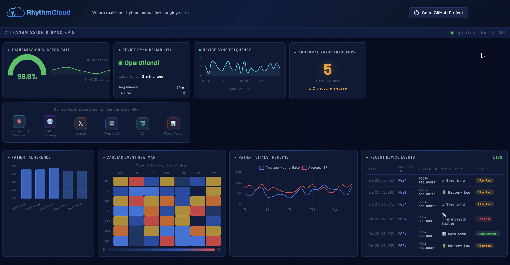

# RhythmCloud — Cloud-Based Remote Patient Monitoring Platform

> **Where real-time rhythm meets life-changing care.**

A production-grade, fully serverless AWS platform that ingests cardiac IoT telemetry, detects abnormal events, computes real-time clinical KPIs, and powers a live operational dashboard — built entirely with AWS Lambda, DynamoDB, S3, API Gateway, and CloudWatch.

[](https://aws.amazon.com/serverless/sam/)
[](https://python.org)
[](https://aws.amazon.com/dynamodb/)
[](LICENSE)

---

## Live Dashboard Preview



The dashboard displays real-time data from AWS — transmission success rates, cardiac event heatmaps, patient adherence scores, and a live device event feed — all powered by serverless APIs.

---

## Table of Contents

- [Overview](#overview)
- [Architecture](#architecture)
- [AWS Services Used](#aws-services-used)
- [Project Structure](#project-structure)
- [API Endpoints](#api-endpoints)
- [Data Models](#data-models)
- [Setup & Deployment](#setup--deployment)
- [Data Simulator](#data-simulator)
- [Athena SQL Queries](#athena-sql-queries)
- [Dashboard Integration](#dashboard-integration)
- [CloudWatch Metrics & Alarms](#cloudwatch-metrics--alarms)
- [Resume Bullets](#resume-bullets)

---

## Overview

RhythmCloud simulates a healthcare platform where wearable cardiac devices send telemetry to the cloud every few seconds. The system:

- **Ingests** patient vitals (heart rate, SpO2, blood pressure, battery level, signal strength) via a REST API
- **Detects** abnormal clinical events — tachycardia, bradycardia, hypoxia, hypertensive crises, transmission failures
- **Computes** rolling KPIs per patient — transmission success rate, sync reliability, adherence score, abnormal event frequency
- **Archives** every raw event to S3 with Hive-style partitioning for Athena SQL analysis
- **Exposes** 9 REST API endpoints that power a live operational dashboard
- **Publishes** custom CloudWatch metrics and alarms for operational monitoring

### Business Context

Remote patient monitoring is a fast-growing segment of digital health. This project simulates the backend of a platform used by clinical teams to monitor cardiac patients outside hospital settings. The architecture mirrors real-world production systems used by companies like Medtronic, iRhythm, and Philips Healthcare.

---

## Architecture

```
┌─────────────────────────────────────────────────────────────────────┐
│                        CLIENT LAYER                                  │
│                                                                      │
│   IoT Cardiac Simulator          HTML Dashboard (Chart.js)          │
│   (scripts/simulate_data.py)     (frontend/rpm-dashboard.html)      │
└──────────────┬──────────────────────────────┬───────────────────────┘
               │ POST /events                 │ GET /dashboard/*
               ▼                              ▼
┌─────────────────────────────────────────────────────────────────────┐
│                        API LAYER                                     │
│                                                                      │
│              Amazon API Gateway (REST API)                          │
│         9 routes · CORS enabled · CloudWatch access logs            │
└──────────┬───────────────────────────────────┬──────────────────────┘
           │                                   │
           ▼                                   ▼
┌──────────────────────┐          ┌────────────────────────────────────┐
│   Lambda: Ingest     │          │   Lambda: Read APIs (×8)           │
│                      │          │                                    │
│ 1. Validate payload  │          │  get_dashboard_kpis                │
│ 2. Write DynamoDB    │          │  get_sync_frequency                │
│ 3. Archive → S3      │          │  get_adherence                     │
│ 4. Write RecentEvents│          │  get_vitals_trend                  │
│ 5. Update DeviceStatus          │  get_heatmap                       │
│ 6. Publish CW metric │          │  get_recent_events                 │
└──────────┬───────────┘          │  get_patient_summary               │
           │                      │  get_patient_events                │
           ▼                      └────────────┬───────────────────────┘
┌──────────────────────┐                       │
│  DynamoDB            │◄──────────────────────┘
│  TelemetryEvents     │  reads PatientSummaries
│  (Streams enabled)   │  + DashboardAggregates
└──────────┬───────────┘
           │ DynamoDB Streams (NEW_IMAGE)
           ▼
┌──────────────────────┐     ┌──────────────────────┐
│  Lambda: KPI Engine  │────►│  DynamoDB             │
│                      │     │  PatientSummaries     │
│ Per patient:         │     │  DashboardAggregates  │
│ · TX success rate    │     │  RecentEvents         │
│ · Sync reliability   │     │  DeviceStatus         │
│ · Adherence score    │     └──────────────────────┘
│ · Abnormal freq      │
│ · Vitals trend       │     ┌──────────────────────┐
│ · Heatmap matrix     │────►│  CloudWatch           │
│                      │     │  Custom Metrics       │
└──────────┬───────────┘     │  + 5 Alarms           │
           │                 └──────────────────────┘
           │ S3 archive (partitioned)
           ▼
┌──────────────────────┐
│  Amazon S3           │
│  Raw Event Archive   │
│                      │
│  year=YYYY/          │
│  month=MM/           │
│  day=DD/             │
│  hour=HH/            │
│  <patientId>/        │
│  <eventId>.json      │
└──────────┬───────────┘
           │
           ▼
┌──────────────────────┐
│  Amazon Athena       │
│  SQL Analysis        │
│                      │
│  · TX success rate   │
│  · Abnormal events   │
│  · Adherence trends  │
│  · Sync reliability  │
│  · Heatmap agg.      │
└──────────────────────┘
```

### Data Flow Summary

| Step | Description |
|------|-------------|
| **1. Ingest** | IoT simulator or real device POSTs telemetry to API Gateway |
| **2. Validate** | Lambda validates all 13 fields — types, ranges, enums, ISO 8601 timestamp |
| **3. Store** | Event written to DynamoDB `TelemetryEvents` with TTL |
| **4. Archive** | Raw JSON archived to S3 with Hive-style partitioning for Athena |
| **5. Stream** | DynamoDB Streams triggers KPI processor Lambda automatically |
| **6. Aggregate** | KPI engine recomputes all patient summaries and dashboard aggregates |
| **7. Metrics** | Custom CloudWatch metrics published for operational visibility |
| **8. Serve** | Dashboard polls 9 API endpoints; data refreshes every 5–60 seconds |

---

## AWS Services Used

| Service | Purpose |
|---------|---------|
| **AWS Lambda** | 10 functions — ingest, KPI processing, 8 dashboard read APIs |
| **Amazon API Gateway** | REST API with CORS, throttling, access logging |
| **Amazon DynamoDB** | 5 tables — events, summaries, aggregates, recent events, device status |
| **Amazon S3** | Raw event archival with Hive-style partitioning |
| **Amazon CloudWatch** | Custom metrics namespace `RhythmCloud`, 5 alarms, operational dashboard |
| **Amazon Athena** | SQL analysis over S3 archived events |
| **AWS SQS** | Dead letter queue for KPI processor stream failures |
| **AWS IAM** | Least-privilege role scoped to exact resources |
| **AWS SAM** | Infrastructure as Code — full stack in `template.yaml` |
| **AWS X-Ray** | Distributed tracing on all Lambda functions |

---

## Project Structure

```
rhythmcloud/
├── template.yaml               # AWS SAM IaC — all AWS resources defined here
├── samconfig.toml              # SAM deploy config for dev/staging/prod
├── requirements.txt            # Python dependencies
├── .gitignore
│
├── frontend/
│   └── rpm-dashboard.html      # Live dashboard — connects to real API endpoints
│
├── src/
│   ├── handlers/
│   │   ├── ingest_event.py         # POST /events
│   │   ├── kpi_processor.py        # DynamoDB Streams trigger
│   │   ├── get_dashboard_kpis.py   # GET /dashboard/kpis
│   │   ├── get_sync_frequency.py   # GET /dashboard/sync-frequency
│   │   ├── get_adherence.py        # GET /dashboard/adherence
│   │   ├── get_vitals_trend.py     # GET /dashboard/vitals-trend
│   │   ├── get_heatmap.py          # GET /dashboard/heatmap
│   │   ├── get_recent_events.py    # GET /dashboard/recent-events
│   │   ├── get_patient_summary.py  # GET /patients/{patientId}/summary
│   │   └── get_patient_events.py   # GET /patients/{patientId}/events
│   │
│   ├── services/
│   │   ├── dynamodb_service.py     # All DynamoDB read/write operations
│   │   ├── s3_service.py           # S3 event archival
│   │   ├── aggregation_service.py  # KPI computation logic
│   │   └── metrics_service.py      # CloudWatch custom metrics
│   │
│   └── utils/
│       ├── validator.py            # Schema validation (types, ranges, enums)
│       ├── response.py             # Standardised API response builders
│       └── time_buckets.py         # Timestamp → heatmap bucket mapping
│
├── scripts/
│   └── simulate_data.py        # Cardiac IoT telemetry simulator
│
├── sql/
│   ├── create_table.sql            # Athena external table DDL
│   ├── transmission_success_rate.sql
│   ├── abnormal_events.sql
│   ├── adherence_trend.sql
│   ├── sync_reliability.sql
│   └── heatmap_aggregation.sql
│
└── events/
    ├── sample_event.json           # Normal vitals event for sam local invoke
    └── sample_abnormal_event.json  # Abnormal event for testing alarms
```

---

## API Endpoints

Base URL: `https://<api-id>.execute-api.<region>.amazonaws.com/dev`

### Ingest

| Method | Path | Description |
|--------|------|-------------|
| `POST` | `/events` | Ingest a telemetry event from a cardiac device |

**Request body:**
```json
{
  "patientId":          "P001",
  "deviceId":           "D-P001-001AB",
  "timestamp":          "2026-03-21T14:32:00Z",
  "heartRate":          87,
  "spo2":               97.5,
  "systolicBP":         122,
  "diastolicBP":        80,
  "batteryLevel":       74,
  "signalStrength":     -68,
  "transmissionStatus": "success",
  "syncStatus":         "synced",
  "eventType":          "vitals"
}
```

**Response (201):**
```json
{
  "message":   "Event ingested successfully.",
  "eventId":   "bfbca5d5-ad56-47e8-b11e-b2af560ffc86",
  "patientId": "P001",
  "s3Key":     "events/year=2026/month=03/day=21/hour=14/P001/<eventId>.json"
}
```

### Dashboard

| Method | Path | Widget | Refresh |
|--------|------|--------|---------|
| `GET` | `/dashboard/kpis` | Gauge + sync card + abnormal counter | 10s |
| `GET` | `/dashboard/sync-frequency` | Device Sync Frequency chart | 30s |
| `GET` | `/dashboard/adherence` | Patient Adherence bar chart | 60s |
| `GET` | `/dashboard/vitals-trend` | Patient Vitals Trending chart | 30s |
| `GET` | `/dashboard/heatmap` | Cardiac Event Heatmap | 60s |
| `GET` | `/dashboard/recent-events` | Recent Device Events table | 5s |

### Patient

| Method | Path | Description |
|--------|------|-------------|
| `GET` | `/patients/{patientId}/summary` | Full KPI summary for one patient |
| `GET` | `/patients/{patientId}/events` | Paginated event history (`?limit=50&nextToken=`) |

---

## Data Models

### DynamoDB Tables

| Table | PK | SK | Purpose |
|-------|----|----|---------|
| `TelemetryEvents` | `patientId` | `eventId` | All raw telemetry events (TTL 90d) |
| `PatientSummaries` | `patientId` | — | Rolling KPIs per patient |
| `DashboardAggregates` | `metricType` | `periodKey` | Pre-computed chart data (TTL 48h) |
| `RecentEvents` | `RECENT` | `timestamp#eventId` | Ring-buffer for events table (TTL 24h) |
| `DeviceStatus` | `deviceId` | — | Latest device snapshot |

### Abnormal Event Detection

An event is classified as abnormal if any of these conditions are true:

| Field | Condition |
|-------|-----------|
| `heartRate` | `< 50 bpm` (bradycardia) or `> 130 bpm` (tachycardia) |
| `spo2` | `< 90%` (hypoxia) |
| `systolicBP` | `> 180 mmHg` (hypertensive crisis) |
| `batteryLevel` | `< 20%` |
| `transmissionStatus` | `"failed"` |
| `syncStatus` | `"failed"` |

---

## Setup & Deployment

### Prerequisites

```bash
# Install AWS CLI v2
brew install awscli

# Install AWS SAM CLI
brew tap aws/tap && brew install aws-sam-cli

# Install Python 3.11
brew install python@3.11

# Verify all tools
aws --version       # aws-cli/2.x.x
sam --version       # SAM CLI, version 1.x.x
python3.11 --version
```

### Configure AWS credentials

```bash
aws configure --profile rhythmcloud
# AWS Access Key ID:     <your key>
# AWS Secret Access Key: <your secret>
# Default region:        eu-north-1
# Default output format: json

export AWS_PROFILE=rhythmcloud
```

### Deploy to AWS

```bash
# Clone the repository
git clone https://github.com/AshlinBangera/Cloud-Based-Remote-Patient-Monitoring-Platform---AWS-Serverless-Project.git
cd Cloud-Based-Remote-Patient-Monitoring-Platform---AWS-Serverless-Project

# Install dependencies
python3 -m venv .venv && source .venv/bin/activate
pip install -r requirements.txt

# Build and deploy (dev environment)
sam build --config-env dev
sam deploy --config-env dev
```

The deploy takes ~3 minutes. The final output shows your live API URL:

```
Outputs:
ApiBaseUrl = https://<id>.execute-api.eu-north-1.amazonaws.com/dev
```

### Test the API

```bash
BASE="https://<your-api-id>.execute-api.eu-north-1.amazonaws.com/dev"

# Ingest an event
curl -X POST $BASE/events \
  -H "Content-Type: application/json" \
  -d @events/sample_event.json

# Check dashboard KPIs
curl $BASE/dashboard/kpis

# Get patient summary
curl $BASE/patients/P001/summary
```

### Tear down

```bash
aws cloudformation delete-stack --stack-name rhythmcloud-dev --region eu-north-1
```

---

## Data Simulator

Generate realistic cardiac telemetry for 5 patients with configurable abnormal rates, transmission failures, and time windows.

```bash
# Standard run — 200 events across 5 patients over 24 hours
python3 scripts/simulate_data.py \
  --patients 5 \
  --events 40 \
  --abnormal-rate 0.15 \
  --hours-back 24 \
  --delay-ms 80

# High-stress test — more abnormal events to trigger alarms
python3 scripts/simulate_data.py --patients 5 --events 20 --abnormal-rate 0.4

# Preview without sending to API
python3 scripts/simulate_data.py --dry-run --events 5
```

**Simulated patient profiles:**

| Patient | Name | Condition |
|---------|------|-----------|
| P001 | Alice Brennan | Atrial fibrillation |
| P002 | Brian Doyle | Heart failure |
| P003 | Catherine Murphy | Hypertension |
| P004 | David O'Sullivan | Arrhythmia |
| P005 | Eleanor Walsh | Coronary artery disease |

**Simulated abnormal events:**
- Tachycardia (HR 130–180 bpm)
- Bradycardia (HR 30–49 bpm)
- Hypertensive crisis (SBP 185–230 mmHg)
- Hypoxia (SpO2 82–89%)
- Transmission failures (8% rate)
- Sync failures (6% rate)
- Battery critical events (<20%)

---

## Athena SQL Queries

Run SQL analysis directly on the S3 raw event archive. All queries use partition projection for cost-efficient scanning.

**Setup:**

```sql
-- 1. Create the database (run once)
CREATE DATABASE IF NOT EXISTS rhythmcloud;

-- 2. Create the external table (run once, replace account ID)
-- See sql/create_table.sql
```

**Available queries:**

| File | Analysis |
|------|---------|
| `transmission_success_rate.sql` | Daily TX success % with 7-day rolling average |
| `abnormal_events.sql` | Abnormal event counts by patient + breakdown by type |
| `adherence_trend.sql` | Per-patient daily adherence score with 7-day rolling avg |
| `sync_reliability.sql` | Device health status, signal quality, failure patterns |
| `heatmap_aggregation.sql` | 7×7 day/time matrix with intensity scores |

**Example — abnormal events by patient:**
```sql
SELECT patientId,
       COUNT(*) AS total_events,
       SUM(CASE WHEN heartRate < 50 OR heartRate > 130 OR spo2 < 90
                THEN 1 ELSE 0 END) AS abnormal_count,
       ROUND(AVG(heartRate), 1) AS avg_heart_rate
FROM rhythmcloud.telemetry_events
WHERE year = '2026' AND month = '03'
GROUP BY patientId
ORDER BY abnormal_count DESC;
```

---

## Dashboard Integration

The live dashboard (`frontend/rpm-dashboard.html`) polls all API endpoints automatically:

| Endpoint | Widget | Interval |
|----------|--------|----------|
| `GET /dashboard/kpis` | Gauge, sync card, abnormal counter | 10s |
| `GET /dashboard/recent-events` | Events table | 5s |
| `GET /dashboard/sync-frequency` | Sync frequency line chart | 30s |
| `GET /dashboard/vitals-trend` | Vitals trending chart | 30s |
| `GET /dashboard/adherence` | Patient adherence bar chart | 60s |
| `GET /dashboard/heatmap` | Cardiac event heatmap | 60s |

**Run locally:**
```bash
cd frontend
python3 -m http.server 8080
# Open http://localhost:8080/rpm-dashboard.html
```

---

## CloudWatch Metrics & Alarms

Custom metrics published to the `RhythmCloud` namespace after every event:

| Metric | Unit | Description |
|--------|------|-------------|
| `TotalEvents` | Count | Every ingested event |
| `AbnormalEvents` | Count | Events exceeding clinical thresholds |
| `TransmissionFailures` | Count | Failed transmissions |
| `SyncFailures` | Count | Failed device syncs |
| `TransmissionSuccessRate` | Percent | Rolling TX success rate |
| `AdherenceScore` | Percent | Average patient adherence |

**Alarms configured:**

| Alarm | Threshold | Action |
|-------|-----------|--------|
| High abnormal event rate | ≥10 events / 5 min | Clinical review required |
| Low transmission success | <90% over 2 periods | Device investigation |
| Low adherence score | <70% hourly avg | Patient outreach |
| Ingest Lambda errors | ≥5 errors / 3 min | Engineering alert |
| KPI processor DLQ depth | ≥1 message | Stream processing failure |

---

## Resume Bullets

> Ready to copy-paste into your CV or LinkedIn profile.

- **Designed and deployed a production-grade serverless remote patient monitoring platform on AWS**, processing cardiac IoT telemetry through a Lambda → DynamoDB Streams → KPI aggregation pipeline with zero server management

- **Architected a real-time clinical data API** using API Gateway + Lambda serving 9 REST endpoints, with pre-computed DynamoDB aggregates enabling sub-100ms dashboard response times across 5 widget types

- **Built a Hive-partitioned S3 data lake** with Athena SQL queries for historical analysis — transmission success rates, patient adherence trends, cardiac event heatmaps — enabling ad-hoc clinical analytics at $5/TB

- **Implemented Infrastructure as Code** using AWS SAM with multi-environment deployment (dev/staging/prod), IAM least-privilege policies, CloudWatch custom metrics, and 5 operational alarms

- **Developed a realistic cardiac IoT simulator** generating 200+ telemetry events per run across 5 patient profiles with configurable abnormal event injection — tachycardia, bradycardia, hypoxia, hypertensive crisis episodes

- **Integrated a live operational dashboard** (HTML/Chart.js) with real-time API polling at 5–60 second intervals, replacing mock data with live AWS backend responses across 7 chart/widget types

---

## License

MIT — see [LICENSE](LICENSE)

---

*Built with AWS Serverless — Lambda, DynamoDB, S3, API Gateway, CloudWatch, Athena*
